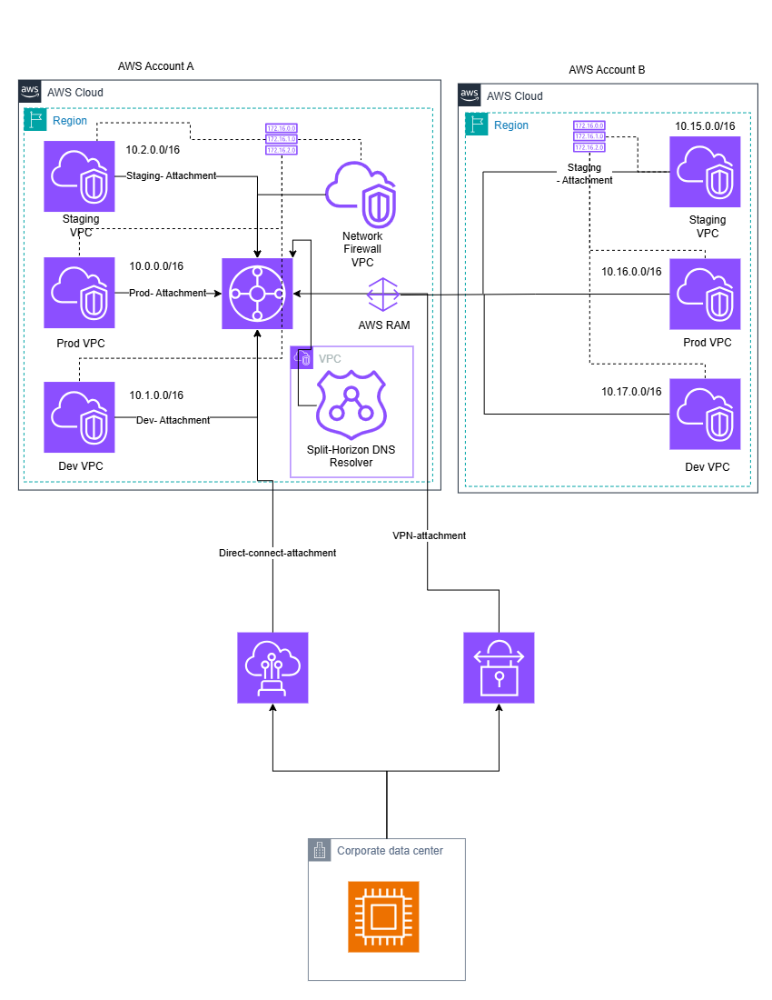

# Hybrid Cloud Connectivity with AWS Transit Gateway and Site-to-Site VPN

Centralized, scalable, and secure network connectivity between multi-account AWS environments and an on-premises corporate data center, using **AWS Transit Gateway**, **AWS Direct Connect**, **AWS Site-to-Site VPN**, **AWS Network Firewall**, **Amazon Route 53 Resolver**, and **AWS Resource Access Manager (RAM)**.

<p align="center">
  
</p>

---

## Table of Contents

- [Solution Overview](#solution-overview)
- [Architecture Diagram](#architecture-diagram)
- [Architecture Components](#architecture-components)
- [How It Works](#how-it-works)
- [Cost](#cost)
- [Prerequisites](#prerequisites)
- [Deployment](#deployment)
  - [Step 1: Deploy the Shared Networking Account (Account A)](#step-1-deploy-the-shared-networking-account-account-a)
  - [Step 2: Share the Transit Gateway with AWS RAM](#step-2-share-the-transit-gateway-with-aws-ram)
  - [Step 3: Deploy Spoke Account Resources (Account B)](#step-3-deploy-spoke-account-resources-account-b)
  - [Step 4: Configure Hybrid Connectivity](#step-4-configure-hybrid-connectivity)
  - [Step 5: Configure DNS Resolution](#step-5-configure-dns-resolution)
- [Repository Structure](#repository-structure)
- [Customization](#customization)
- [Security](#security)
- [Uninstall](#uninstall)
- [Collection of Operational Metrics](#collection-of-operational-metrics)
- [Contributing](#contributing)
- [License](#license)

---

## Solution Overview

Organizations that operate across multiple AWS accounts and maintain an on-premises corporate data center need a network design that is **centralized**, **secure**, and **easy to scale** as new business units, environments, or regions are added.

This solution demonstrates a hub-and-spoke hybrid connectivity model built around **AWS Transit Gateway** as the central hub. It shows how to:

- Interconnect multiple VPCs (Dev, Staging, Prod) across **two or more AWS accounts** without relying on VPC peering mesh.
- Share a single Transit Gateway across accounts using **AWS RAM**, avoiding the operational overhead of deploying and managing one Transit Gateway per account.
- Inspect and control east-west and north-south traffic centrally with **AWS Network Firewall**.
- Provide redundant, resilient hybrid connectivity back to an on-premises **corporate data center** using both **AWS Direct Connect** (primary) and **Site-to-Site VPN** (backup/failover).
- Resolve DNS consistently across AWS and on-premises environments using a **Route 53 Resolver (Split-Horizon DNS)** endpoint.

This repository is intended as **reference architecture and documentation** — a blueprint teams can use as a starting point for their own Infrastructure-as-Code (Terraform / AWS CDK / CloudFormation) implementation.

---

## Architecture Diagram

<p align="center">
  
</p>

The diagram above illustrates:

1. **Two AWS accounts** (Account A – networking/shared services hub, Account B – spoke/workload account), each deployed in the same AWS Region.
2. **AWS Transit Gateway (TGW)** deployed in Account A, acting as the central routing hub.
3. **AWS RAM** sharing the Transit Gateway from Account A into Account B so that spoke VPCs can attach to it without duplicating infrastructure.
4. **Three VPCs per account** — `Dev`, `Staging`, and `Prod` — each attached to the Transit Gateway via its own **TGW attachment** (`Dev-Attachment`, `Staging-Attachment`, `Prod-Attachment`), enabling per-environment route table isolation.
5. A dedicated **Network Firewall VPC** in Account A used to centrally inspect traffic routed through the Transit Gateway.
6. A dedicated **VPC hosting the Route 53 Resolver** for **Split-Horizon DNS**, allowing consistent name resolution between AWS private hosted zones and the on-premises DNS namespace.
7. **AWS Direct Connect** — the primary, high-bandwidth, low-latency private connection between the Transit Gateway and the on-premises **corporate data center**.
8. **AWS Site-to-Site VPN** — an IPsec-encrypted backup path over the internet, providing resilient failover connectivity if Direct Connect is unavailable.

---

## Architecture Components

| Component | Purpose |
|---|---|
| **AWS Transit Gateway** | Central hub that interconnects all VPCs and on-premises attachments via a single, scalable routing point. Removes the need for full-mesh VPC peering. |
| **AWS RAM (Resource Access Manager)** | Shares the Transit Gateway from the hub account (Account A) with spoke accounts (e.g., Account B), enabling cross-account attachments without copying resources. |
| **VPC Attachments** (Dev, Staging, Prod) | Each environment/workload VPC attaches independently to the Transit Gateway, enabling per-environment route tables and traffic segmentation. |
| **AWS Network Firewall** | Centralized, stateful traffic inspection and filtering for traffic transiting the Transit Gateway (east-west and north-south). |
| **Amazon Route 53 Resolver (Split-Horizon DNS)** | Resolves DNS queries differently depending on where they originate (AWS vs. on-premises), using inbound/outbound resolver endpoints. |
| **AWS Direct Connect** | Primary dedicated network connection between AWS and the corporate data center, offering consistent latency and higher throughput than internet-based VPN. |
| **AWS Site-to-Site VPN** | Encrypted IPsec tunnel used as a backup path to the corporate data center, or as the primary path where Direct Connect is not available. |
| **Corporate Data Center** | On-premises environment hosting existing workloads, directory services, and DNS infrastructure that must interoperate with AWS. |

---

## How It Works

1. Workloads in the `Dev`, `Staging`, and `Prod` VPCs (in either account) send traffic destined for another VPC, another account, or the corporate data center to their local Transit Gateway attachment.
2. The Transit Gateway route tables determine whether traffic is routed directly to another attachment, or redirected through the **Network Firewall VPC** for inspection before continuing to its destination.
3. Traffic destined for on-premises resources is routed out through the **Direct Connect attachment**. If Direct Connect is unavailable, Transit Gateway route propagation fails over traffic to the **Site-to-Site VPN attachment**.
4. DNS queries for on-premises namespaces originating in AWS are forwarded through the **Route 53 Resolver outbound endpoint** to on-premises DNS servers, and queries for AWS private hosted zones originating on-premises are forwarded through the **inbound endpoint** — achieving full split-horizon resolution.
5. Because the Transit Gateway is shared via **AWS RAM**, additional spoke accounts can attach their own VPCs to the same hub without any changes to Account A, allowing the architecture to scale horizontally as new accounts/business units are onboarded.

---

## Cost

You are responsible for the cost of the AWS services used while running this solution. As of this writing, the primary cost drivers are:

- **AWS Transit Gateway** — hourly charge per attachment + data processing charge per GB.
- **AWS Direct Connect** — port-hour charges + data transfer out.
- **AWS Site-to-Site VPN** — hourly charge per VPN connection + data transfer.
- **AWS Network Firewall** — hourly charge per firewall endpoint + data processing charge per GB.
- **Amazon Route 53 Resolver** — hourly charge per resolver endpoint (inbound/outbound) + per-query charges.

We recommend creating a [Budget](https://docs.aws.amazon.com/cost-management/latest/userguide/budgets-managing-costs.html) through [AWS Cost Explorer](https://aws.amazon.com/aws-cost-management/aws-cost-explorer/) to monitor costs and set alerts for anomalous spend.

---

## Prerequisites

- Two or more AWS accounts (e.g., a networking/hub account and one or more spoke/workload accounts), ideally managed under [AWS Organizations](https://aws.amazon.com/organizations/).
- [AWS CLI](https://aws.amazon.com/cli/) v2 configured with credentials/profiles for each account.
- [Terraform](https://www.terraform.io/) >= 1.5 **or** [AWS CDK](https://aws.amazon.com/cdk/) v2, depending on which implementation track you use in `/iac`.
- An existing or provisioned **AWS Direct Connect** connection/virtual interface, or a **Customer Gateway** device (physical or software-based, e.g., a VPN-capable firewall/router) at the corporate data center for the Site-to-Site VPN.
- Sufficient IAM permissions in each account to create Transit Gateways, TGW attachments, RAM resource shares, VPN Gateways, Direct Connect Gateway associations, Network Firewall resources, and Route 53 Resolver endpoints.
- Non-overlapping CIDR ranges across all VPCs and the on-premises network (as shown in the diagram: `10.0.0.0/16`–`10.2.0.0/16` in Account A, `10.15.0.0/16`–`10.17.0.0/16` in Account B).

---

## Deployment

> The steps below describe the deployment flow at a reference-architecture level. Adapt commands to match the Infrastructure-as-Code tooling included in this repository's `/iac` directory (Terraform or CDK).

### Step 1: Deploy the Shared Networking Account (Account A)

Deploy the Transit Gateway, Network Firewall VPC, and Route 53 Resolver VPC into the hub account.

```bash
cd iac/account-a
terraform init
terraform plan -var-file=envs/account-a.tfvars
terraform apply -var-file=envs/account-a.tfvars
```

This provisions:
- The Transit Gateway and its default route table(s)
- The `Dev`, `Staging`, and `Prod` VPCs with their respective TGW attachments
- The Network Firewall VPC, firewall policy, and rule groups
- The Split-Horizon DNS Resolver VPC with inbound/outbound Route 53 Resolver endpoints

### Step 2: Share the Transit Gateway with AWS RAM

From Account A, create a Resource Share for the Transit Gateway and specify the target spoke account (Account B) as a principal:

```bash
aws ram create-resource-share \
  --name "tgw-hub-share" \
  --resource-arns arn:aws:ec2:<region>:<account-a-id>:transit-gateway/<tgw-id> \
  --principals <account-b-id>
```

In **Account B**, accept the resource share invitation:

```bash
aws ram accept-resource-share-invitation \
  --resource-share-invitation-arn <invitation-arn>
```

### Step 3: Deploy Spoke Account Resources (Account B)

Deploy the spoke VPCs (`Dev`, `Staging`, `Prod`) and attach them to the shared Transit Gateway:

```bash
cd iac/account-b
terraform init
terraform plan -var-file=envs/account-b.tfvars -var="tgw_id=<shared-tgw-id>"
terraform apply -var-file=envs/account-b.tfvars -var="tgw_id=<shared-tgw-id>"
```

### Step 4: Configure Hybrid Connectivity

1. **Direct Connect**: Associate an existing Direct Connect Gateway with the Transit Gateway (Transit Gateway attachment type: Direct Connect Gateway association), and configure the corresponding Direct Connect Virtual Interface (VIF) at the corporate data center.
2. **Site-to-Site VPN**: Create a Customer Gateway resource representing the on-premises VPN device, then create a Site-to-Site VPN connection attached directly to the Transit Gateway for backup/failover connectivity.
3. Update Transit Gateway route tables to prefer the Direct Connect attachment and fail over to the VPN attachment (e.g., via BGP path preference/AS-PATH prepending, or static route priority).

### Step 5: Configure DNS Resolution

1. Create a **Route 53 Resolver outbound endpoint** in the Resolver VPC and associate forwarding rules that send queries for on-premises domains to the corporate DNS servers.
2. Create a **Route 53 Resolver inbound endpoint** so that on-premises DNS servers can forward queries for AWS private hosted zone domains into AWS.
3. Associate the relevant Route 53 private hosted zones with the `Dev`, `Staging`, and `Prod` VPCs in both accounts as needed.

---

## Repository Structure

```
.
├── architecture/
│   └── hybrid-cloud-connectivity-architecture.png   # Solution architecture diagram
├── iac/
│   ├── account-a/                                   # Hub account: TGW, Network Firewall, Resolver
│   │   └── envs/
│   ├── account-b/                                   # Spoke account: VPCs + TGW attachments
│   │   └── envs/
│   └── modules/                                     # Reusable Terraform/CDK modules
├── docs/
│   └── DESIGN.md                                    # Extended design notes & routing tables
├── README.md
└── LICENSE
```

---

## Customization

This reference architecture is intended to be adapted:

- **Additional spoke accounts**: Repeat Step 3, attaching new spoke VPCs to the same shared Transit Gateway — no changes required in the hub account.
- **Additional Regions**: Deploy a Transit Gateway per Region and use **Transit Gateway peering** to interconnect hubs across Regions.
- **Stricter segmentation**: Use separate Transit Gateway route tables per environment (`Dev`, `Staging`, `Prod`) to enforce isolation, only propagating routes where cross-environment communication is explicitly required.
- **Alternative on-prem connectivity**: If Direct Connect is not available, deploy Site-to-Site VPN as the sole (primary) hybrid connectivity path; consider dual-tunnel, dual-Customer-Gateway configurations for higher resiliency.

---

## Security

- All traffic transiting the Transit Gateway between environments/accounts can be routed through the **Network Firewall VPC** for centralized inspection, logging, and policy enforcement.
- Site-to-Site VPN tunnels use IPsec encryption in transit; Direct Connect traffic can be additionally encrypted using [MACsec](https://docs.aws.amazon.com/directconnect/latest/UserGuide/direct-connect-mac-sec.html) where supported.
- Use least-privilege IAM policies and separate AWS RAM resource shares per consuming account.
- Enable [VPC Flow Logs](https://docs.aws.amazon.com/vpc/latest/userguide/flow-logs.html) and [Transit Gateway Flow Logs] for network traffic visibility.

If you discover a potential security issue in this project, please follow the guidance in [CONTRIBUTING.md](CONTRIBUTING.md#security-issue-notifications) and **do not** create a public GitHub issue.

---

## Uninstall

Destroy resources in reverse order of creation to avoid dependency errors (spoke accounts first, then the hub account):

```bash
# Spoke account(s)
cd iac/account-b
terraform destroy -var-file=envs/account-b.tfvars

# Hub account
cd iac/account-a
terraform destroy -var-file=envs/account-a.tfvars
```

> Some resources (e.g., Direct Connect Virtual Interfaces, physical cross-connects) may need to be decommissioned manually through the AWS console or with your Direct Connect partner.

---

## Collection of Operational Metrics

This solution's reference implementation may include an option to collect anonymous operational metrics, including: solution version, Region deployed, and number of accounts/VPCs attached. This data helps us understand usage patterns and improve the solution. You can opt out at any time by setting the corresponding metrics flag to `false` in your deployment variables. See [docs/DESIGN.md](docs/DESIGN.md) for details.

---

## Contributing

Contributions are welcome! Please see [CONTRIBUTING.md](CONTRIBUTING.md) for guidelines on submitting issues and pull requests.

---

## License

This library is licensed under the MIT-0 License. See the [LICENSE](LICENSE) file.
